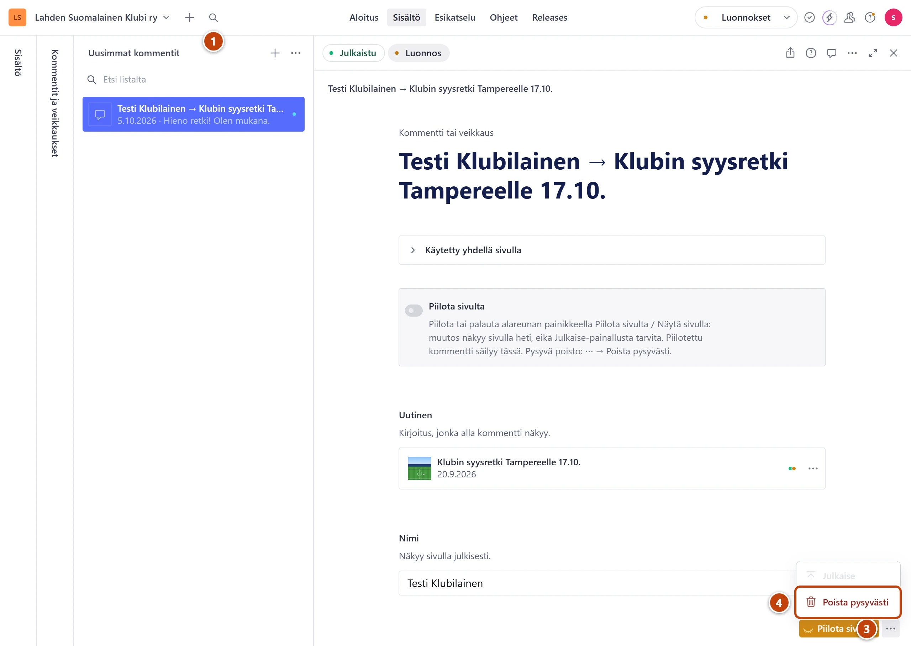

## Milloin

Kun joku pyytää poistamaan kirjoittamansa kommentin, veikkauksen tai ravintola-arvostelun kuvineen. Tietosuojaseloste on sivustolla osoitteessa https://www.lahdensuomalainenklubi.com/tietosuoja.

## Askeleet

1. Etsi henkilön nimi yläpalkin haulla. ① Ohje: [Etsi sisältö haulla](../alkuun/etsi-haulla.md).
2. Avaa hänen kommenttinsa tai arvostelunsa.
3. Oikeassa alakulmassa paina kolmen pisteen painiketta (⋯). ③ Toimintovalikko aukeaa.
4. Kommentti tai veikkaus: valitse **Poista pysyvästi** ja vahvista. ④
5. Arvostelu: valitse **Poista arvostelu** ja vahvista. Hyväksymättömässä arvostelussa kohta on **Hylkää arvostelu**.
   Arvostelun kuvat poistuvat samalla.
6. Toista jokaiselle henkilön viestille.
7. Vastaa pyytäjälle, että tiedot on poistettu.

> [!WARNING]
> Pysyvää poistoa ei voi perua, eikä viestiä palauteta varmuuskopiosta. Piilottaminen ei riitä tietosuojapyyntöön: piilotettu viesti säilyy järjestelmässä.

## Tulos

- Viesti ei näy sivulla eikä Studiossa.
- Haku henkilön nimellä ei löydä enää hänen viestejään.

## Lisävalinnat

- Asiaton viesti, jota ei pyydetty poistamaan: [Piilota asiaton kommentti](../uutiset/kommenttien-valvonta.md)
- Liite, jossa on henkilötietoja: poista liite tekstistä ja julkaise. Tiedosto poistuu itsestään 7 päivän kuluttua.
- Jos liite pitää saada pois heti, kerro tukihenkilölle tiedoston nimi.

## Jos jokin menee vikaan

- Ilmoitus "Poisto epäonnistui": odota hetki ja yritä uudelleen.
- Henkilöä ei löydy haulla: kokeile pelkkää etunimeä tai sukunimeä. Kommentissa nimi on kentässä **Nimi**, arvostelussa kentässä **Arvostelijan nimi**.

Katso myös: [Etsi sisältö haulla](../alkuun/etsi-haulla.md) · [Hyväksy tai hylkää kävijän arvostelu](../ravintolat/arvostelun-hyvaksynta.md)
