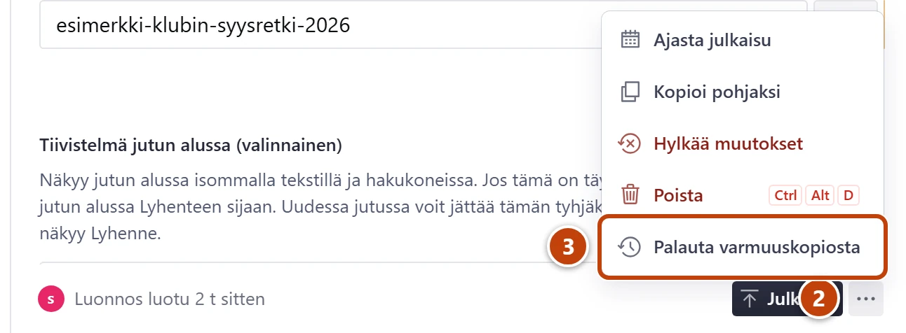
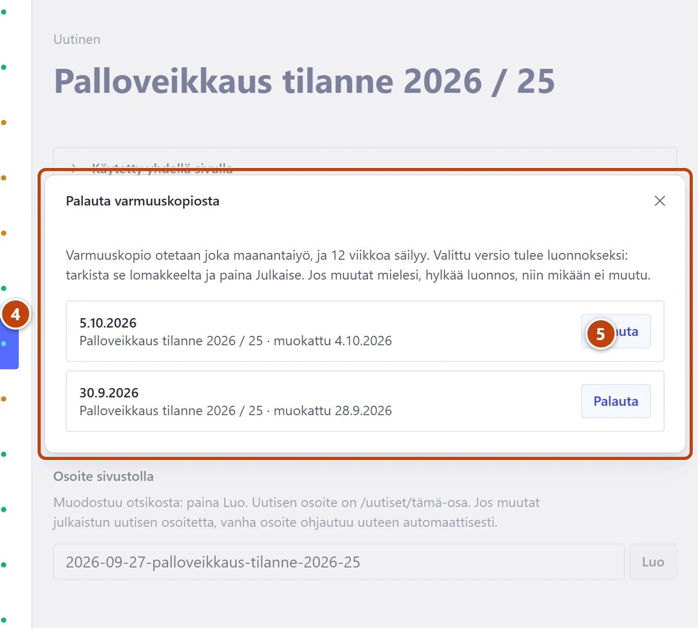

## Milloin

Kun huomaat virheen, joka on tehty niin kauan sitten, ettei historia enää ulotu siihen. Esimerkiksi taulukosta on kadonnut rivi pari viikkoa sitten.

## Ennen kuin aloitat

- Tuoreen virheen perut nopeammin historiasta: [Tallenna, julkaise ja peru muutos](../alkuun/luonnos-julkaisu-ja-peruminen.md).

## Askeleet

1. Avaa sisältö, jossa virhe on, esim. uutinen tai taulukko.
2. Oikeassa alakulmassa paina **Julkaise**-painikkeen vieressä olevaa kolmen pisteen painiketta (⋯). ②
3. Valitse **Palauta varmuuskopiosta**. ③ Ikkuna aukeaa.

4. Lue viikot, uusin ensin. ④
   Rivillä on kopion päivä, sisällön nimi ja milloin sitä oli muokattu, esim. "muokattu 4.10.2026". Jos versio on sama kuin nyt, rivillä lukee "sama kuin nykyinen julkaistu".
5. Paina sopivan viikon kohdalla **Palauta**. ⑤
   Vanha versio tulee luonnokseksi. Sivusto ei vielä muutu.
6. Tarkista lomakkeelta, että sisältö on oikea.
7. Paina **Julkaise**.

## Tulos

- Sivustolla näkyy palautettu versio noin minuutin kuluessa.

## Lisävalinnat

- Valitsit väärän viikon: palauta toinen viikko, tai valitse toimintovalikosta **Hylkää muutokset**. Silloin kaikki jää ennalleen.
- Kokonaan poistettu sisältö: [Palauta poistettu sisältö](poistetun-palautus.md)

> [!NOTE]
> Kommentteja ja kävijöiden ravintola-arvosteluja ei palauteta varmuuskopiosta.

## Jos jokin menee vikaan

- Rivillä ei ole **Palauta**-painiketta: versio on sama kuin nykyinen tai jokin uudempi. Valitse vanhempi viikko.
- Rivillä lukee "Ei mukana: dokumenttia ei silloin ollut julkaistuna.": sisältöä ei ollut vielä sinä viikkona.
- Ilmoitus kertoo, että tiedosto tai kuva puuttuu: se on ehditty poistaa. Lisää tiedosto uudelleen ennen julkaisua.

Katso myös: [Tarkista ja lataa varmuuskopio](varmuuskopiot.md) · [Poistin vahingossa](../vianetsinta/poistin-vahingossa.md)
