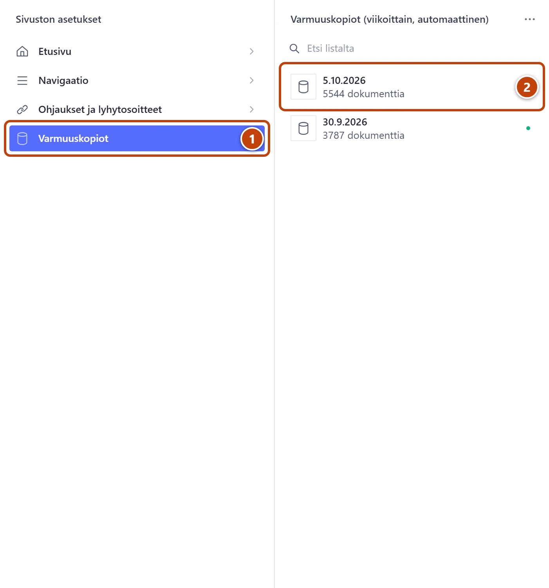
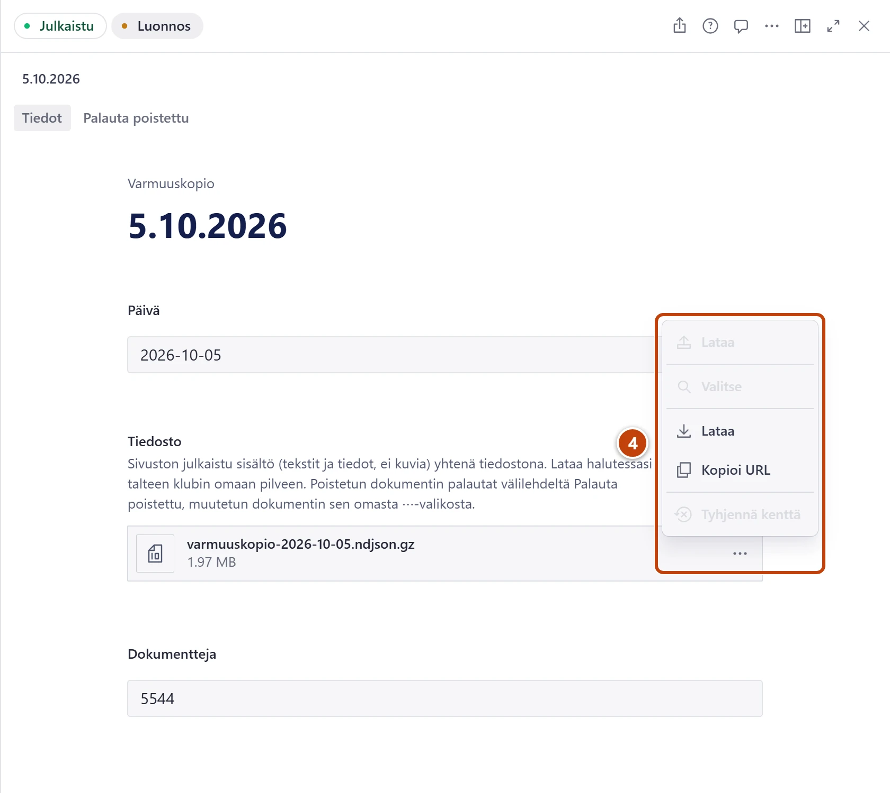

## Milloin

Kun haluat varmistaa, että sivuston sisältö on tallessa, tai ladata kopion klubin omaan pilveen. Kerran kuussa riittää. Sivusto tekee kopion joka maanantaiyö itse.

## Askeleet

1. Vasemmasta valikosta valitse **Sivuston asetukset → Varmuuskopiot**. ①
   Lista **Varmuuskopiot (viikoittain, automaattinen)** aukeaa.
2. Tarkista, että ylimmän kopion päivä on alle viikon vanha. ②
   Saman näet Aloituksen rivillä **Varmuuskopio**.
3. Avaa uusin kopio. Välilehdellä **Tiedot** näkyvät päivä ja tiedosto.

4. Kentässä **Tiedosto** paina tiedoston oikean reunan kolmea pistettä. ④
   Valikossa on kaksi kohtaa **Lataa**. Valitse alempi, jossa on alaspäin osoittava nuoli. Ylempi on harmaa.
5. Tallenna tiedosto klubin omaan pilvikansioon.

## Tulos

- Kopio on tallessa myös klubin omassa pilvessä.
- Studiossa säilyy 12 viimeisintä viikkokopiota, eli noin kolme kuukautta.

## Lisävalinnat

- Yksittäisen sisällön vanha versio: [Palauta vanha versio varmuuskopiosta](vanhan-version-palautus.md)
- Poistetun sisällön palautus: [Palauta poistettu sisältö](poistetun-palautus.md)

> [!NOTE]
> Kopiossa ovat kaikki julkaistut tekstit ja tiedot, mutta ei kuvia. Kuvat säilyvät Sanityssa, ja tukihenkilö ottaa niistä erillisen kopion isompien muutosten yhteydessä.
> Kopioita ei voi muokata eikä poistaa käsin.

## Jos jokin menee vikaan

- Ylin kopio on yli viikon vanha tai Aloituksen rivi **Varmuuskopio** on punainen: kerro tukihenkilölle rivin teksti. Sisältösi on tallessa.
- Lataus ei ala: kokeile toista selainta tai tietokonetta.
- Koko sivuston palautus kopiosta: sen tekee tukihenkilö.

Katso myös: [Lue Aloitus ja sivuston tila](../alkuun/aloitus-ja-sivuston-tila.md) · [Mihin tarvitset tukihenkilöä](../hakuteos/tukihenkilo.md)
