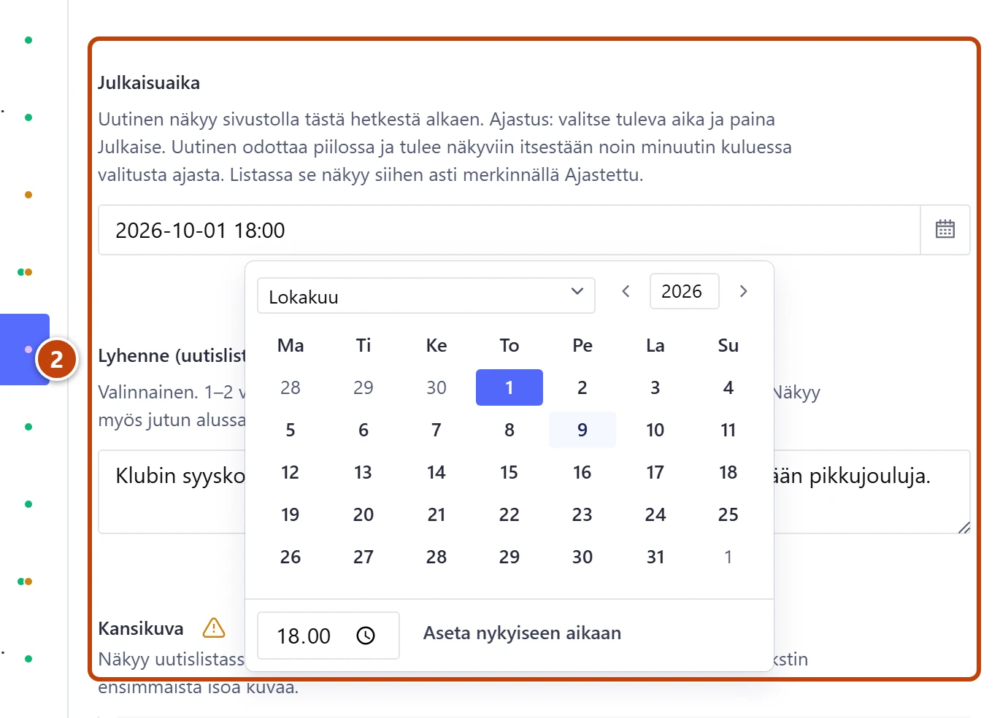
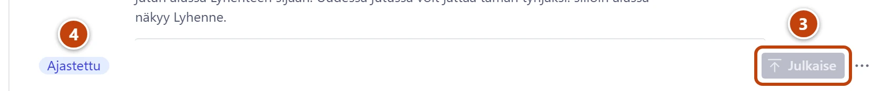

## Milloin

Kun uutinen pitää saada näkyviin myöhemmin, esim. vuosikokouskutsu maanantaina kello 8. Kirjoitat ja julkaiset nyt, ja uutinen tulee sivustolle itsestään valittuna aikana.

## Ennen kuin aloitat

- Uutinen on kirjoitettu valmiiksi. Katso [Kirjoita uutinen](uutisen-kirjoittaminen.md).

## Askeleet

1. Avaa uutinen.
2. Kentän **Julkaisuaika** oikeassa reunassa paina kalenterin kuvaa. Valitse päivä ja kirjoita kellonaika, jolloin uutinen tulee näkyviin. ②
   Alapalkkiin tulee heti merkki **Ajastettu**.
3. Paina **Julkaise**. ③ Ajastus alkaa vasta tästä.
   Uutinen odottaa piilossa. Kävijät eivät näe sitä ennen valittua aikaa.

4. Tarkista, että alapalkissa on merkki **Ajastettu**. ④
   Uutislistassa uutisen kohdalla lukee "Ajastettu" ja aika.

## Tulos

- Uutinen tulee sivustolle noin minuutin kuluessa valitusta ajasta.
- Siihen asti se on listassa **Tehtävät sinulle → Ajastetut uutiset**.

## Lisävalinnat

- Julkaise heti: valitse kalenterista **Aseta nykyiseen aikaan** ja paina **Julkaise**.
- Siirrä aikaa: muuta **Julkaisuaika** ja paina **Julkaise** uudelleen.

> [!WARNING]
> Älä käytä toimintovalikon Sanityn omaa toimintoa **Ajasta julkaisu**. Klubin ajastus tehdään aina kentällä **Julkaisuaika**.

## Jos jokin menee vikaan

- Merkin selitys sanoo "…, kun painat Julkaise.": muutit aikaa, mutta et julkaissut. Paina **Julkaise**.
- Uutinen ei näy ajan jälkeen: odota minuutti ja päivitä sivu. Katso [Uutinen ei näy sivustolla, ja alapalkissa lukee Ajastettu](../vianetsinta/uutinen-ei-nay-ajastettu.md).
- Linkissä toiseen sivuun näkyy keltainen "Uutinen tulee näkyviin …": linkki ajastettuun uutiseen näkyy sivustolla vasta sen julkaisuaikana. Tämä on normaalia.

Katso myös: [Kirjoita uutinen](uutisen-kirjoittaminen.md) · [Aloita uutinen valmiista pohjasta](valmiit-pohjat.md)
