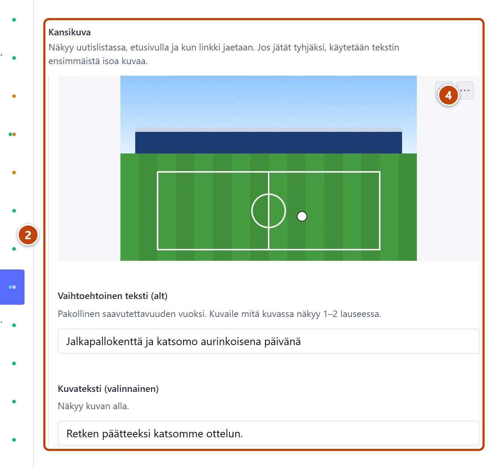

## Milloin

Kun jaat sivuston linkin WhatsAppissa tai Facebookissa. Linkin esikatselussa näkyy kuva, otsikko ja osoite. Kuva valitaan automaattisesti, mutta oma kuva näyttää parhaalta.

## Ennen kuin aloitat

- Hyvä jakokuva on vaakakuva, vähintään noin 1200 pikseliä leveä.
- Kuvaan ei tarvitse lisätä tekstiä tai logoa. Otsikko näkyy kuvan vieressä.

## Askeleet

1. Avaa uutinen, tapahtuma tai sivu.
2. Lisää kuva sisällön omaan kuvakenttään. ②
   Uutisessa ja tapahtumassa se on **Kansikuva**, sivulla **Iso kuva sivun yläosassa**.
3. Kirjoita **Vaihtoehtoinen teksti (alt)**.
4. Paina **Rajaa kuva** ja vedä ympyrä kuvan tärkeimmän kohdan päälle. ④
   Jako rajaa kuvan tämän kohdan ympäriltä.
5. Paina **Julkaise**.
6. Jaa linkki vasta julkaisun jälkeen.

## Tulos

- Jaetun linkin esikatselussa näkyy valitsemasi kuva.

## Lisävalinnat

- Kuvan lisäys ja rajaus tarkemmin: [Lisää tai vaihda kuva](../tekstit/kuva.md)

> [!NOTE]
> Jos omaa kuvaa ei ole, jakoon otetaan ensin tekstin ensimmäinen riittävän iso kuva. Sen jälkeen YouTube-videon kuva ja lopuksi klubin logo.
> Hyvin pieniä kuvia ei käytetä, koska ne näyttäisivät suttuisilta.

## Jos jokin menee vikaan

- Jaossa näkyy klubin logo: sisällössä ei ole riittävän isoa kuvaa. Lisää isompi kuva ja julkaise.
- Jaossa näkyy vanha kuva: WhatsApp ja Facebook muistavat kerran jaetun linkin kuvan. Uusi kuva näkyy vasta jonkin ajan kuluttua.
- Kuvasta leikkautuu tärkeä kohta: siirrä ympyrää rajausikkunassa ja julkaise uudelleen.

Katso myös: [Kirjoita uutinen](uutisen-kirjoittaminen.md) · [Lisää tai vaihda kuva](../tekstit/kuva.md)
