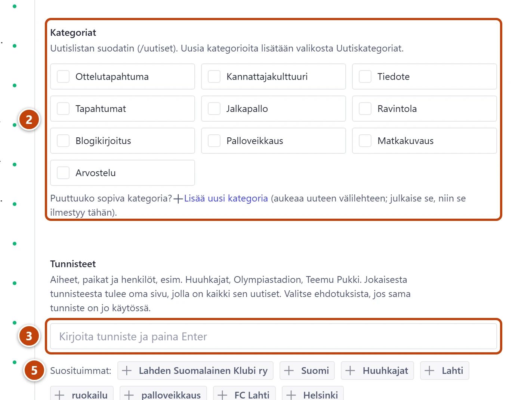

## Milloin

Jokaisessa uutisessa. Kategoria ja tunniste ovat eri asioita:

| | Kategoria | Tunniste |
|---|---|---|
| Mikä | Laaja aihe, esim. Tapahtumat tai Palloveikkaus | Tarkka aihe: joukkue, paikka tai henkilö, esim. Huuhkajat |
| Montako | 1–2 uutista kohden | Niin monta kuin sopii, enintään 30 |
| Missä näkyy | Uutislistan suodattimessa | Jokaisella tunnisteella on oma sivu, jolla on kaikki sen uutiset |
| Uusi | Valikon kohdassa **Uutiskategoriat** | Kirjoitetaan suoraan kenttään |

## Askeleet

1. Avaa uutinen.
2. Kohdassa **Kategoriat** rastita yksi tai kaksi sopivaa aihetta. ②
3. Kirjoita kenttään **Tunnisteet** pari ensimmäistä kirjainta. ③
4. Jos sopiva tunniste on listassa, valitse se. Muuten kirjoita uusi ja paina Enter.
   Listassa näkyy, montako uutista tunnisteella jo on.
5. Yleisimmän tunnisteen saat myös rivin **Suosituimmat:** painikkeista. ⑤
6. Turhan tunnisteen poistat sen vieressä olevasta rastista (×).
7. Lopuksi paina **Julkaise**.

## Tulos

- Uutinen löytyy uutislistalta kategorian suodattimella.
- Jokaisen tunnisteen sivulla näkyy tämä uutinen muiden samanaiheisten kanssa.

## Lisävalinnat

- Uusi kategoria: valikosta **Uutiskategoriat** → listan yläreunan plus-painike → **Nimi** → kentän **Osoite suodattimessa** vieressä **Luo** → **Julkaise**. Kohdassa **Järjestys suodattimessa** pienin numero tulee ensin.
- Uuden kategorian voi tehdä myös uutisesta linkillä **Lisää uusi kategoria**. Se aukeaa uuteen välilehteen.
- Kategorian nimen voi vaihtaa milloin tahansa. Uusi nimi näkyy kaikissa uutisissa.
- Kategorian kohtaan **Kuvaus hakukoneille (valinnainen)** voit kirjoittaa lyhyen kuvauksen Googlen hakutuloksiin.
- Vanhan blogin kirjoituksissa välilehdellä **Hakukoneet ja jako** on kohta **Alkuperäinen Blogspot-kirjoitus**. Se on vain muisto, eikä sitä muokata.

> [!TIP]
> Päätä kategoria kerran ja pidä se. Jos et ole varma, valitse yksi laaja kategoria ja lisää tarkemmat aiheet tunnisteiksi.

## Jos jokin menee vikaan

- Tunnisteesta tuli eri muoto kuin kirjoitit, esim. "huuhkajat" → "Huuhkajat": Studio käyttää jo vakiintunutta muotoa. Tämä on oikein.
- Punainen "Samanniminen kategoria on jo olemassa.": käytä olemassa olevaa kategoriaa.
- Kategoriaa ei voi poistaa: jokin uutinen käyttää sitä. Poista rasti niistä uutisista ensin.

Katso myös: [Kirjoita uutinen](uutisen-kirjoittaminen.md) · [Sanasto](../hakuteos/sanasto.md)
