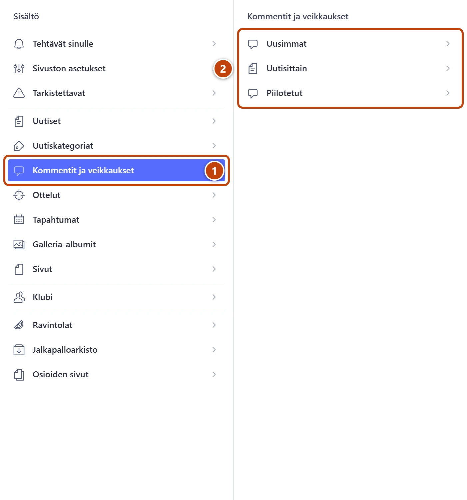
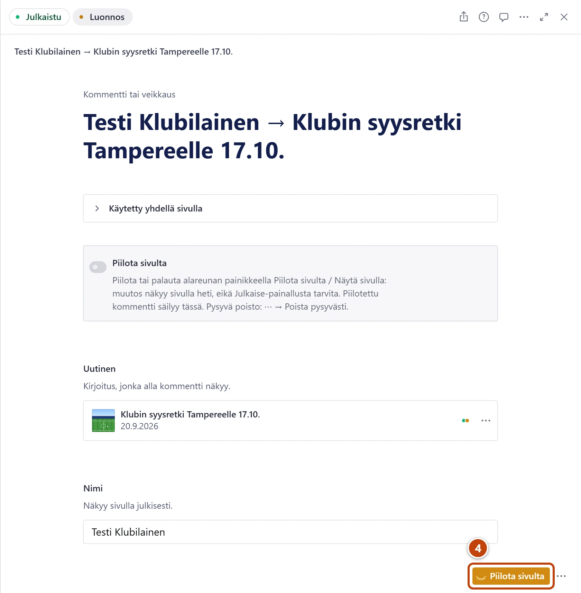

## Milloin

Kun uutisen alle on tullut asiaton viesti tai roskapostia. Kommentit näkyvät sivulla heti, joten ne luetaan jälkikäteen.

## Askeleet

1. Vasemmasta valikosta valitse **Kommentit ja veikkaukset**. ①
   Viikon uudet viestit löydät myös kohdasta **Tehtävät sinulle → Uudet kommentit (7 päivää)**.
2. Valitse **Uusimmat**, **Uutisittain** tai **Piilotetut**. ②
   **Uutisittain** näyttää yhden uutisen kaikki viestit, esim. yhden veikkauksen vastaukset.
3. Avaa viesti ja lue se.

4. Asiaton viesti: paina alareunasta **Piilota sivulta**. ④
   Viesti katoaa sivulta heti. **Julkaise**-painallusta ei tarvita.

## Tulos

- Piilotettu viesti ei näy sivulla. Studiossa se säilyy.
- Listassa sen edessä on merkki 🚫, ja alapalkissa lukee **Piilotettu**.

## Lisävalinnat

- Palauta piilotettu viesti: avaa se listasta **Piilotetut** ja paina **Näytä sivulla**.
- Kommentoinnin sulkeminen uutiselta: [Avaa veikkaus tai kommentointi](veikkaus-ja-kommentit.md)
- Jos kirjoittaja pyytää poistamaan viestinsä kokonaan: [Poista henkilön tiedot pyynnöstä](../turvaverkko/tietosuojapyynto.md)

> [!WARNING]
> Toimintovalikon **Poista pysyvästi** poistaa viestin lopullisesti. Sitä ei voi palauttaa edes varmuuskopiosta. Käytä tavallisesti **Piilota sivulta**.

## Jos jokin menee vikaan

- Piilotus ei onnistu: odota hetki ja paina **Piilota sivulta** uudelleen.
- Piilotettu viesti näkyy yhä sivulla: päivitä sivu. Jos sivustolla on yläreunassa esikatselutilan palkki, paina "Poistu esikatselusta".

Katso myös: [Avaa veikkaus tai kommentointi](veikkaus-ja-kommentit.md) · [Tilamerkit ja listojen merkinnät](../hakuteos/tilamerkit.md)
