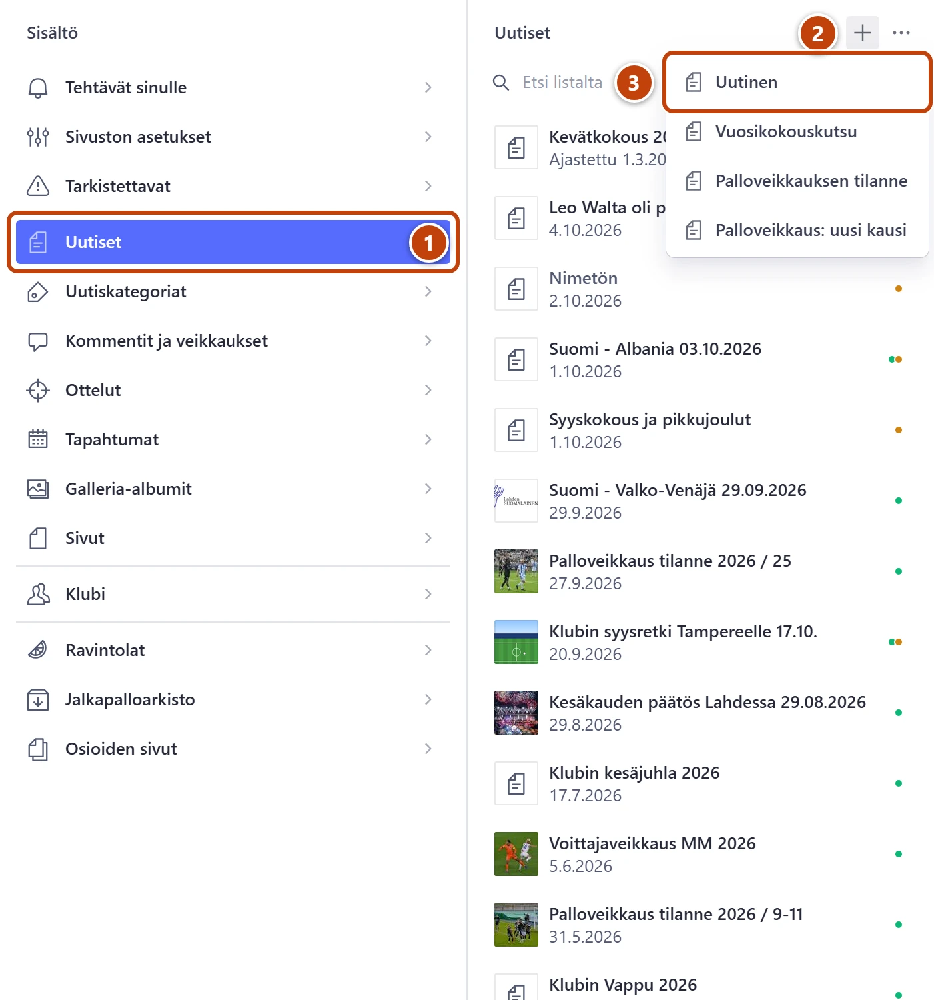
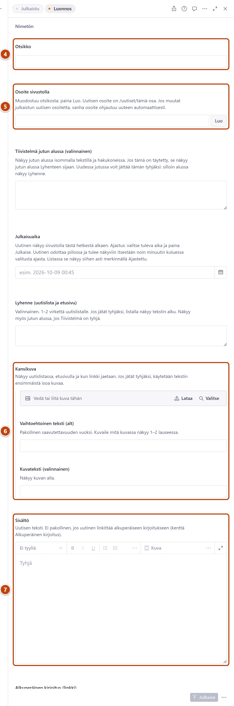

## Milloin

Kun haluat kertoa klubin asioista: tapahtumasta, matkasta, ottelusta tai tiedotteesta. Uutinen näkyy etusivulla ja uutislistassa. Uudet jutut kirjoitetaan tänne, ei enää vanhaan blogiin.

Vuosikokouskutsu tai palloveikkaus? Käytä valmista pohjaa: [Aloita uutinen valmiista pohjasta](valmiit-pohjat.md).

## Ennen kuin aloitat

- Otsikko ja teksti ovat valmiina, tai kirjoitat ne suoraan Studioon.
- Halutessasi yksi kuva tietokoneella tai puhelimessa.

## Askeleet

1. Vasemmasta valikosta valitse **Uutiset**. ①
2. Listan yläreunassa paina plus-painiketta (+), **Luo uusi asiakirja**. ② Pohjien valikko aukeaa.
3. Valitse **Uutinen**. ③ Tyhjä uutislomake aukeaa.

4. Kirjoita kenttään **Otsikko** uutisen otsikko. ④
5. Kentän **Osoite sivustolla** vieressä paina **Luo**. ⑤
   Kenttään ilmestyy otsikosta tehty osoite.
6. Halutessasi lisää kuva kenttään **Kansikuva** ja kirjoita **Vaihtoehtoinen teksti (alt)**. ⑥
7. Vieritä alaspäin ja kirjoita tai liitä teksti kenttään **Sisältö**. ⑦
   Kirjoita alkuun pari virkettä, jotka kertovat, mistä jutussa on kyse.
8. Kohdassa **Kategoriat** rastita sopiva aihe. Lisää kohtaan **Tunnisteet** tarkemmat aiheet.
9. Lue teksti läpi. Kaikki tallentuu itsestään, joten älä paina **Julkaise** kesken.
10. Kun uutinen on valmis, paina oikeassa alakulmassa **Julkaise**.

## Tulos

- Ruudulle tulee ilmoitus **Dokumentti on julkaistu**, ja **Julkaise** muuttuu harmaaksi.
- Uutinen näkyy etusivulla ja uutislistassa minuutin kuluessa: https://www.lahdensuomalainenklubi.com/uutiset

## Lisävalinnat

- Uutinen näkyviin myöhemmin: [Ajasta uutinen](ajasta-uutinen.md)
- Kategorian ja tunnisteen ero: [Valitse kategoria ja tunnisteet](kategoriat-ja-tunnisteet.md)
- Kuvia tekstin sekaan: [Lisää tai vaihda kuva](../tekstit/kuva.md)
- Video tai kartta: [Lisää video, kartta tai lomake](../tekstit/video-kartta-lomake.md)
- Veikkaus tai kommentit uutisen alle: [Avaa veikkaus tai kommentointi](veikkaus-ja-kommentit.md)
- **Lyhenne (uutislista ja etusivu)**: 1–2 virkettä uutislistaan. Tyhjänä listassa näkyy tekstin alku.
- **Tiivistelmä jutun alussa (valinnainen)**: isompi johdanto jutun alkuun. Tyhjänä alussa näkyy Lyhenne. Lisää: [Mikä teksti näkyy missä](../hakuteos/mika-teksti-nakyy-missa.md)
- **Lähde**: jos uutinen on lainattu muualta, kirjoita **Lähteen nimi**, esim. palloliitto.fi.
- Välilehdellä **Hakukoneet ja jako** voit kirjoittaa Googlen tekstit: **Otsikko hakutuloksissa (valinnainen)** ja **Kuvaus hakutuloksissa (valinnainen)**.

## Jos jokin menee vikaan

- **Julkaise** on harmaa, ja välilehden nimen vieressä on punainen huutomerkki: jokin pakollinen kenttä on tyhjä. Katso [Julkaise on harmaa](../vianetsinta/julkaise-ei-onnistu.md).
- Uutinen ei näy sivustolla: tarkista, että painoit **Julkaise**. Jos **Julkaisuaika** on tulevaisuudessa, uutinen on ajastettu. Katso [Uutinen ei näy sivustolla, ja alapalkissa lukee Ajastettu](../vianetsinta/uutinen-ei-nay-ajastettu.md).
- Kirjoitit väärin ja julkaisit jo: korjaa teksti ja paina **Julkaise** uudelleen.

Mikään ei katoa: keskeneräinen uutinen säilyy luonnoksena, vaikka suljet selaimen.

Katso myös: [Aloita uutinen valmiista pohjasta](valmiit-pohjat.md) · [Tallenna, julkaise ja peru muutos](../alkuun/luonnos-julkaisu-ja-peruminen.md) · [Valitse kuva, joka näkyy jaossa](jakokuva.md)
