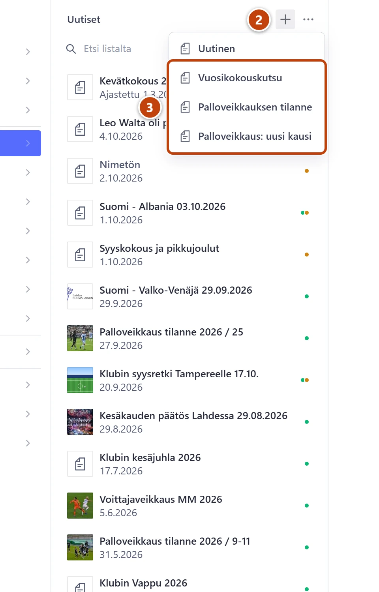
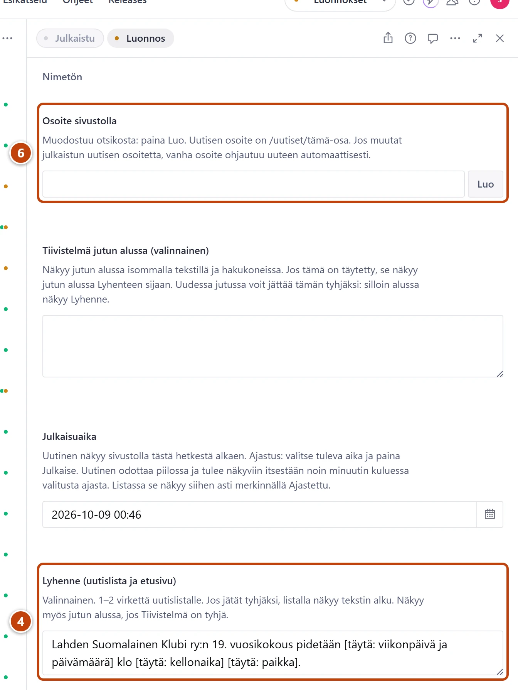

## Milloin

Kun kirjoitat toistuvan uutisen: vuosikokouskutsun, palloveikkauksen tilanteen tai uuden palloveikkauskauden. Pohjassa ovat valmiina otsikko, teksti, kategoriat ja tunnisteet.

## Askeleet

1. Vasemmasta valikosta valitse **Uutiset**.
2. Listan yläreunassa paina plus-painiketta (+). ② Pohjien valikko aukeaa.
3. Valitse **Vuosikokouskutsu**, **Palloveikkauksen tilanne** tai **Palloveikkaus: uusi kausi**. ③

4. Etsi hakasulkeet, esim. [täytä: kellonaika]. ④
   Niitä on esim. kentissä **Lyhenne (uutislista ja etusivu)** ja **Sisältö**, joissakin pohjissa myös **Otsikko**.
5. Kirjoita tilalle oikea tieto ja poista hakasulkeet. Esim. [täytä: kellonaika] → 18.00.
6. Kun otsikko on valmis, paina kentän **Osoite sivustolla** vieressä **Luo**. ⑥
7. Uusi kausi: avaa välilehti **Kommentit ja veikkaus**. Täytä **Joukkueet** ja **Veikkaus sulkeutuu**.
8. Tarkista **Kategoriat** ja **Tunnisteet**. Ne ovat valmiina.
9. Lopuksi paina **Julkaise**.

## Tulos

- Uutinen näkyy sivustolla kuten tavallinen uutinen.
- Uudessa kaudessa jäsenet voivat veikata uutisen alla.

## Lisävalinnat

- Pohjat löytyvät myös yläpalkin vasemmasta reunasta plus-painikkeesta (**Luo uusi asiakirja**). Kirjoita hakuun esim. "vuosi".
- Viime vuoden uutinen pohjaksi: avaa uutinen, toimintovalikosta valitse **Kopioi pohjaksi**. Kopio aukeaa samalla otsikolla. Anna uusi otsikko, paina **Luo** ja valitse **Julkaisuaika** (kalenterin **Aseta nykyiseen aikaan**). Veikkauksessa valitse myös **Veikkaus sulkeutuu**.
- Veikkauksen asetukset: [Avaa veikkaus tai kommentointi](veikkaus-ja-kommentit.md)
- Sarjataulukko riveinä samassa kappaleessa: Shift + Enter vaihtaa rivin.

## Jos jokin menee vikaan

- Punainen "Täytä vielä hakasulkeissa olevat kohdat: …": tekstiin jäi hakasulkeet. Virhe kertoo, mitkä. Täytä ne ja paina **Julkaise**.
- Kategoria puuttuu pohjasta: kategoria on nimetty uudelleen tai poistettu. Rastita oikea käsin.
- Valitsit väärän pohjan: valitse toimintovalikosta **Hylkää muutokset** ja vahvista. Luonnos poistuu. Aloita alusta. Tavallisen uutisen saat pohjasta **Uutinen**.

Katso myös: [Kirjoita uutinen](uutisen-kirjoittaminen.md) · [Ajasta uutinen](ajasta-uutinen.md)
