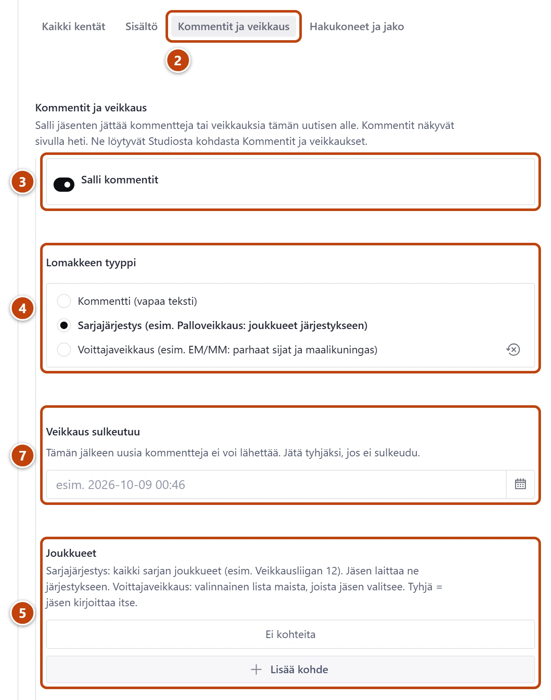

## Milloin

Kun jäsenet saavat veikata tai kommentoida uutisen alla, esim. palloveikkaus, EM-kisojen voittajaveikkaus tai "Suomen paras avaus". Viesti näkyy sivulla heti, ja asiattomat piilotetaan jälkikäteen.

## Ennen kuin aloitat

- Uusi palloveikkauskausi on nopein valmiista pohjasta: [Aloita uutinen valmiista pohjasta](valmiit-pohjat.md).

## Askeleet

1. Avaa uutinen, tai kirjoita uusi. Kirjoita veikkauksen säännöt tekstiin.
2. Valitse lomakkeen yläosasta välilehti **Kommentit ja veikkaus**. ②
3. Kytke päälle **Salli kommentit**. ③ Lisää kenttiä tulee näkyviin.
4. Kohdassa **Lomakkeen tyyppi** valitse yksi: ④
   - **Kommentti (vapaa teksti)**
   - **Sarjajärjestys (esim. Palloveikkaus: joukkueet järjestykseen)**
   - **Voittajaveikkaus (esim. EM/MM: parhaat sijat ja maalikuningas)**
5. Sarjajärjestys: lisää kohtaan **Joukkueet** sarjan kaikki joukkueet, yksi kerrallaan painikkeella **Lisää kohde**. ⑤
6. Voittajaveikkaus: valitse **Montako sijaa veikataan** ja käännä tarvittaessa kytkin **Kysy myös maalikuningasta** päälle.
7. Valitse **Veikkaus sulkeutuu**, esim. ensimmäisen kierroksen alku. ⑦ Tyhjänä veikkaus ei sulkeudu.
8. Halutessasi kirjoita **Ohje jäsenille**. Se näkyy lomakkeen yläpuolella.
9. Lopuksi paina **Julkaise**.

## Tulos

- Uutisen alla on lomake, jolla jäsenet lähettävät veikkauksen tai kommentin.
- Viestit näkyvät Studiossa kohdassa **Kommentit ja veikkaukset**.

## Lisävalinnat

- Sulje kommentointi: kytke pois **Salli kommentit** ja paina **Julkaise**.
- Viestien lukeminen ja piilotus: [Piilota asiaton kommentti](kommenttien-valvonta.md)
- Viime vuoden veikkaus pohjaksi: toimintovalikosta **Kopioi pohjaksi**. Valitse kopioon uusi **Veikkaus sulkeutuu**.

## Jos jokin menee vikaan

- Punainen "Lisää vähintään kaksi joukkuetta.": sarjajärjestys tarvitsee joukkueet.
- Punainen "Sama joukkue on listalla kahdesti.": poista toinen.
- Jäsenet eivät pääse veikkaamaan: tarkista **Veikkaus sulkeutuu**. Jos aika on mennyt, siirrä sitä ja julkaise.

Katso myös: [Kirjoita uutinen](uutisen-kirjoittaminen.md) · [Piilota asiaton kommentti](kommenttien-valvonta.md)
