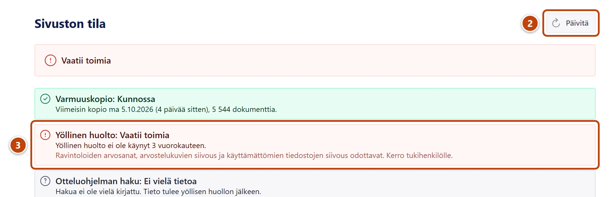

**Mitä näet:** Aloituksen kohdassa **Sivuston tila** yhteenveto on punainen ja siinä lukee
**Vaatii toimia**, tai se on keltainen ja siinä lukee **Huomioitavaa**. Jollakin rivillä lukee
**Vaatii toimia** tai **Huomio**.

**Miksi:** Jokin automaattinen työ ei ole onnistunut. Sisältösi ei katoa, vaikka rivi on punainen.

**Näin korjaat:**

1. Jatka työtä normaalisti. Voit kirjoittaa ja julkaista.
2. Paina **Päivitä**. ② Joskus tieto on vain vanhentunut.
3. Lue rivin otsikko, teksti ja ohje. ③
4. Toimi alla olevan taulukon mukaan.

| Rivi | Mitä teet |
|---|---|
| **Varmuuskopio**, Vaatii toimia | Kerro tukihenkilölle. Vanhaa versiota ei voi palauttaa varmuuskopiosta ennen uutta kopiota. |
| **Varmuuskopio**, Huomio | Kopio on tallessa. Kerro tukihenkilölle, jos sama toistuu ensi viikolla. |
| **Yöllinen huolto**, Vaatii toimia | Kerro tukihenkilölle. Ravintoloiden arvosanat ja siivous odottavat. |
| **Yöllinen huolto**, Huomio | Kerro tukihenkilölle, jos sama toistuu useana yönä. |
| **Otteluohjelman haku**, Vaatii toimia tai Huomio | Lisää tärkeät ottelut käsin: [Lisää ottelu](../ottelut/ottelun-lisaaminen.md). Kerro tukihenkilölle. |
| **Julkaisemattomat muutokset**, Huomio | Paina **Avaa julkaisemattomat muutokset**. Julkaise muutokset tai hylkää ne: [Luonnos, julkaisu ja peruminen](../alkuun/luonnos-julkaisu-ja-peruminen.md). |
| **Dokumenttikiintiö (arvio)**, Huomio | Kerro tukihenkilölle. Kun raja täyttyy, uutta sisältöä ei voi tallentaa. |

Harmaa rivi, jossa lukee **Ei vielä tietoa**, ei vaadi toimia. Kiintiön rivillä lukee
tavallisesti **Arvio**. Talvella otteluhaun rivillä voi lukea "Talvitauko", mikä on normaalia.

Jos Aloituksessa lukee "Sivuston tilaa ei saatu haettua. Yritä hetken kuluttua uudelleen
Päivitä-painikkeesta.", odota hetki ja paina **Päivitä**.

**Ei auttanut?** Kerro tukihenkilölle rivin otsikko ja teksti sanatarkasti, tai lähetä
kuvakaappaus. Ohje: [Aloitus ja sivuston tila](../alkuun/aloitus-ja-sivuston-tila.md).
