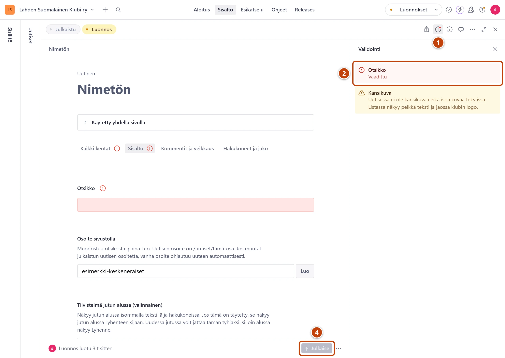

**Mitä näet:** **Julkaise** on harmaa, eikä sitä voi painaa. Kun viet hiiren sen päälle, lukee
"Ennen tämän dokumentin julkaisemista on korjattava validointivirheet". Välilehden nimen ja
kentän nimen vieressä on punainen huutomerkki, ja kenttä on punertava.

**Miksi:** Pakollinen kenttä on tyhjä, tai jossakin kentässä on virhe.

**Näin korjaat:**

1. Lomakkeen oikeassa yläkulmassa paina punaista huutomerkkiä (**Validointi**). ①
   Oikealle aukeaa lista: kentän nimi ja virheen teksti.
2. Paina listan riviä. ② Lomake siirtyy punaiseen kenttään.
3. Korjaa kenttä alla olevan taulukon mukaan. Kun virhe on korjattu, rivi katoaa listasta.
4. Kun lista on tyhjä, oikeassa alakulmassa paina **Julkaise**. ④

Saman tekstin näet, kun viet hiiren kentän nimen vieressä olevan huutomerkin päälle.

| Virheen teksti | Mitä teet |
|---|---|
| "Vaadittu" | Kenttä on pakollinen. Täytä se. |
| "Alt-teksti on pakollinen (3–200 merkkiä)." | Kirjoita kuvalle **Vaihtoehtoinen teksti (alt)**: mitä kuvassa näkyy. |
| "Täytä vielä hakasulkeissa olevat kohdat: …" | Pohjasta tehtyyn tekstiin jäi kohta [täytä: …]. Kirjoita tilalle oikea tieto ja poista hakasulkeet. |
| "Sisältö on pakollinen." | Kirjoita uutisen teksti kenttään **Sisältö**. |
| "Tiivistelmä on tällä sivulla pakollinen: …" | Kirjoita johdanto kenttään **Tiivistelmä sivun alussa**. |
| "Valitse sivu, johon linkki vie." | Valitse linkin kenttään **Sivu** sivu listasta. |
| "Valitse, mihin linkki vie." | Valitse **Mihin linkki vie?** ja täytä kohde. |
| "Valittua sivua ei enää ole. Valitse toinen sivu." | Linkin sivu on poistettu. Valitse toinen sivu. |

Keltaiset tekstit ovat vain huomautuksia. Ne eivät estä julkaisua.

Jos **Julkaise** on harmaa ja sen kohdalla lukee "Julkaistu … sitten", kaikki on jo julkaistu.

**Ei auttanut?** Ota kuvakaappaus punaisesta kentästä ja lähetä se tukihenkilölle.
Luonnoksesi säilyy sillä välin, vaikka suljet selaimen.
